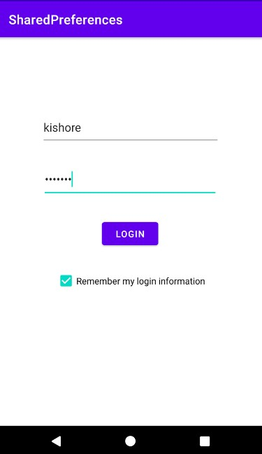

## Shared Preferences

> App that saves login info in the form of key-value pairs.

    

	

---
💠 For More Reference, Visit Here : [Shared-Preferences](https://developer.android.com/reference/android/content/SharedPreferences)
